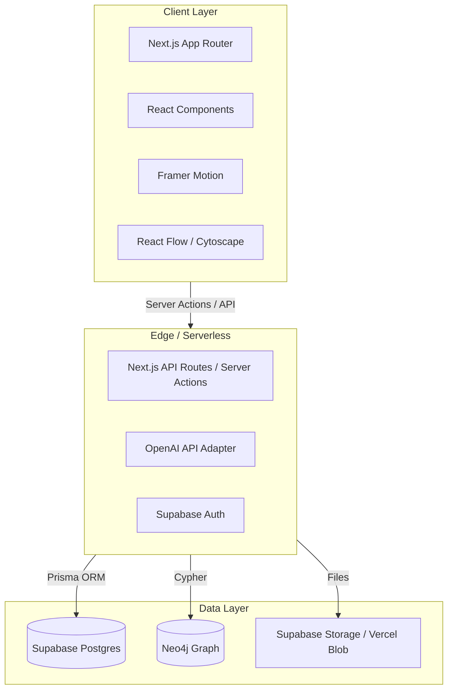

# System Architecture

## Goal

Build a single-user Strategic Operating System that becomes a daily command center. The system is relationship-driven, not document-driven: every entity is a node, and relationships are first-class.

## Design principles

1. **Graph-first mental model.** Every entity (Person, Ministry, Project, Opportunity, etc.) is a node. Relationships are explicit, typed, and queryable.
2. **Modular layers.** UI, API, graph, and AI are independent modules. Each can be replaced or scaled independently.
3. **Single user now, multi-tenant later.** The schema and auth layer should not assume a single user, but the MVP does not implement multi-tenant billing or admin.
4. **Dark mode first.** UI is designed for a calm, focused, command-center feel.
5. **AI as a peer.** The assistant reads the graph, not just documents, and answers relationship-aware questions.

## High-level architecture

## Layer responsibilities

### Client Layer (Next.js App Router)
- Server Components for data fetching where possible.
- Client Components for interactivity, motion, and graph canvas.
- Route groups mirror primary navigation: `/dashboard`, `/mission`, `/government`, `/relationships`, `/products`, `/research`, `/projects`, `/meetings`, `/opportunities`, `/documents`, `/tasks`, `/ai`.

### Edge / Serverless Layer
- Next.js API routes and Server Actions handle business logic.
- Supabase Auth provides session tokens.
- OpenAI adapter translates graph context into prompts and parses responses.
- Graph sync worker keeps Neo4j in sync with Postgres entity changes (initially manual or via triggers; later a background job).

### Data Layer
- **Supabase Postgres:** canonical store for users, profiles, nodes, properties, relationships, tasks, meetings, documents, and projects.
- **Neo4j:** graph-optimized store for relationship queries and visualizations. Populated from Postgres via a sync layer.
- **Object storage:** uploaded documents, avatars, exports.

## Sync strategy

Postgres is the source of truth. Neo4j is a read-optimized projection. The sync layer can be:

- **Phase 1:** Manual re-sync button or API call.
- **Phase 2:** Database triggers or Supabase webhooks that queue sync jobs.
- **Phase 3:** Event stream or change-data-capture pipeline.

## Security model

- Row Level Security (RLS) in Supabase for all tables. Initially a single owner role.
- Neo4j isolated from direct client access; only the backend queries it.
- API keys for OpenAI and Neo4j stored in Vercel environment variables, never shipped to the client.

## Scalability considerations

- Graph queries are offloaded to Neo4j.
- File storage is separate from application data.
- AI calls are rate-limited and cached when possible.
- The architecture supports future multi-tenant isolation via an `organization_id` column on nodes and a tenant-aware sync layer.
