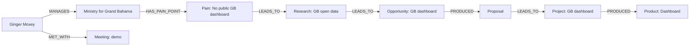
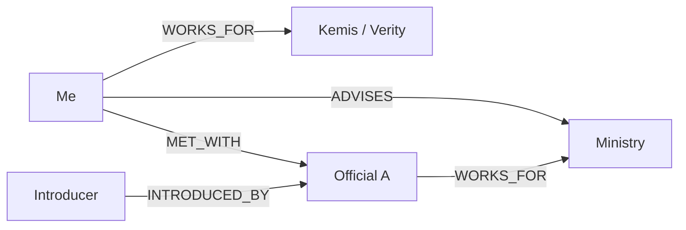

# Graph Model

## Philosophy

Every entity is a node. Every connection is a relationship. The graph is the canonical way to represent how mission, people, government, research, products, and opportunities interrelate.

## Node labels

| Label | Purpose | Key properties |
|-------|---------|----------------|
| Person | Contacts, stakeholders, advisors, officials | photo, title, email, phone, trust_level, relationship_strength, last_meeting_at, next_follow_up_at |
| Organization | Businesses, NGOs, universities, banks, utilities | type, website, location, trust_level |
| Ministry | Government ministries | mission, current_priorities, pain_points |
| Agency | Government agencies | mandate, reports_to |
| Department | Sub-units of ministries/agencies | scope, parent |
| Project | Initiatives with timelines and deliverables | vision, status, start_date, end_date, budget |
| Meeting | Conversations, calls, events | scheduled_at, duration, outcome, ai_summary |
| Opportunity | Potential deals or engagements | estimated_value, probability, status, next_action |
| Research | Research tracks | problem, hypothesis, status, data_sources |
| Product | Products in the Kemis/Verity portfolio | vision, roadmap, status, current_version, future_version |
| Proposal | Written proposals | status, submitted_at, value |
| Document | Notes, files, reports | doc_type, file_url, content |
| Idea | Captured concepts | status, source |
| Task | Action items | status, priority, due_date |
| Goal | Strategic goals | timeframe, status |
| Technology | Tech stack/components | category, status |
| Location | Geographic entities (island, district, town) | type, coordinates |
| Pilot | Pilot programs | status, start_date, end_date |
| CaseStudy | Past work/case studies | outcome, metrics |
| Dashboard | Dashboard instances | url, status |

## Relationship types

| Type | Meaning | Typical source → target |
|------|---------|-------------------------|
| RELATED_TO | Generic association | any → any |
| WORKS_FOR | Employment / affiliation | Person → Organization/Ministry/Agency |
| PART_OF | Hierarchical inclusion | Department → Ministry, Agency → Ministry, Town → District |
| ADVISES | Advisory relationship | Person → Ministry/Project/Organization |
| SUPPORTS | Backing / sponsorship | Organization → Project/Opportunity |
| OWNS | Ownership | Organization → Product/Project |
| MANAGES | Management responsibility | Person → Project/Ministry |
| MET_WITH | Meeting attendance | Person/Organization → Meeting |
| CREATED | Authorship | Person → Document/Research/Proposal |
| FOLLOWS | Strategic alignment | Project → Goal, Product → Mission |
| DEPENDS_ON | Dependency | Project → Project, Task → Project |
| LEADS_TO | Causation / pipeline | Research → Opportunity, Opportunity → Project |
| PILOTS | Pilot relationship | Pilot → Project/Product |
| PRODUCED | Deliverable output | Project → Product/Document |
| HAS_TASK | Task containment | Node → Task |
| HAS_DOCUMENT | Document attachment | Node → Document |
| HAS_MEETING | Meeting attachment | Node → Meeting |
| HAS_RESEARCH | Research link | Ministry/Product → Research |
| HAS_OPPORTUNITY | Opportunity link | Ministry/Organization → Opportunity |
| INTRODUCED_BY | Referral | Person → Person |
| COMPETES_WITH | Competitive relationship | Organization → Organization |

## Sample graph patterns

### Government opportunity pipeline



### Relationship network



## Query examples

1. **Who should I contact next?**
   ```cypher
   MATCH (p:Person)-[:MET_WITH|WORKS_FOR|ADVISES]->(n)
   WHERE p.next_follow_up_at < datetime() + duration('P7D')
   RETURN p.name, p.next_follow_up_at, collect(n.name) as contexts
   ORDER BY p.next_follow_up_at
   ```

2. **Which ministries need dashboards?**
   ```cypher
   MATCH (m:Ministry)
   OPTIONAL MATCH (m)-[:HAS_PRODUCT]->(d:Dashboard)
   WHERE d IS NULL
   RETURN m.name, m.current_priorities
   ```

3. **Which research supports this meeting?**
   ```cypher
   MATCH (me:Meeting)<-[:HAS_MEETING]-(n)-[:HAS_RESEARCH]->(r:Research)
   WHERE me.id = $meetingId
   RETURN r.name, r.problem, n.name
   ```

4. **What opportunities are stalled?**
   ```cypher
   MATCH (o:Opportunity {status: 'stalled'})
   OPTIONAL MATCH (o)-[:CUSTOMER]->(c)
   RETURN o.name, o.next_action, o.estimated_value, c.name
   ```

## Graph visualization rules

- Color nodes by label.
- Size nodes by importance (trust_level, relationship_strength, or inferred centrality).
- Highlight edges on hover.
- Allow filtering by label and relationship type.
- Support zoom, pan, and cluster expansion.
- Clicking a node opens its detail pane and relationship graph.
